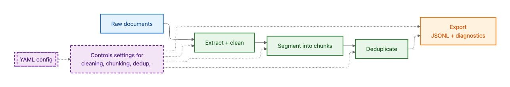
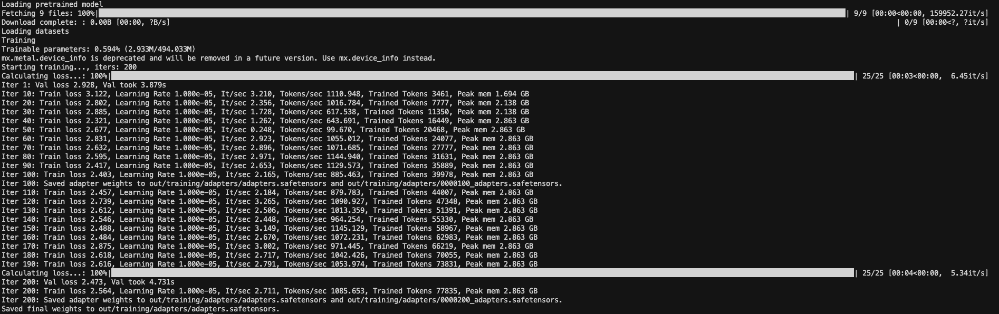

# Multi-Source Text Corpus for LLM Domain Adaptation

**REDOUAN ASSAKALI,**

MSc Applied Artificial Intelligence, Amsterdam University of Applied Sciences, The Netherlands

Tutorial. Publication date: January 2026.

---

## 1. Introduction

Organisational text resources often exist as diverse documents such as formal letters, reports, and meeting transcripts stored in PDF form. The methodological goal considered here is domain adaptation of a language model so that generated text better reflects the vocabulary and style observed in these internal materials. Continued pretraining is a commonly used strategy for domain adaptation when the available data is predominantly unstructured text. [1]

In practice, raw PDF extraction frequently yields artifacts that reduce direct usability for training. Typical issues include spurious line breaks, repeated headers, fragmented paragraphs, and the insertion of page numbers or section titles into otherwise coherent text. Transcripts introduce additional structural tokens such as speaker labels and timestamps. Without preprocessing, these artifacts can dominate model inputs and undermine the quality of the resulting training corpus.

A compact, configuration driven pipeline is therefore presented to convert varied source documents into a unified JSONL corpus. The same implementation is executed under three configurations: a baseline run, a privacy aware run, and a training ready run. Each configuration produces a JSONL corpus plus diagnostics, enabling systematic comparison of how preprocessing choices change segment counts, masking prevalence, and training-ready exports.

**End state of the tutorial.** The workflow concludes with three concrete deliverables. First, a unified multi-source corpus exported as JSONL with lightweight provenance fields, suitable for continued pretraining. Second, a dataset card generated from run artefacts that combines declared metadata with measured statistics for traceable reporting and reuse. Third, a minimal LoRA-based fine-tuning run that verifies the training-ready splits load correctly and produces adapter weights written to disk, providing a domain-adapted model artefact that can be loaded for downstream use. 

---

## 2. Related work

This tutorial adopts a pipeline oriented view of data preparation in which preprocessing decisions are explicit, reproducible, and evaluated through measurable outputs. Dataset documentation frameworks motivate this approach by formalising how data collection, transformation, and intended use should be reported. [2]

Deduplication is widely used as a corpus level control step, since repeated or near repeated content can influence training behaviour and can bias evaluation through contamination. [4] Privacy related considerations are introduced only as a minimal precaution for experimentation, motivated by evidence that training data can be memorised and later extracted under certain conditions. [6]

---

## 3. Requirements and scope

### 3.1 Practical requirements for applying the pipeline to new data

The approach assumes that preprocessing outcomes can be verified quantitatively before training.

- **Extractability:** text extraction should yield predominantly readable language rather than fragmented glyphs. A practical check is a low proportion of empty lines and a high proportion of lines containing alphabetic characters after extraction.
- **Controllable noise:** cleaning should measurably reduce layout artefacts. This can be monitored through simple diagnostics such as repeated line frequency, non alphabetic character ratio, and the share of very short segments before and after cleaning.
- **Bounded segmentation:** segments should stay within configured limits. This is verified via segment length distributions and outlier counts.
- **Run level accountability:** each run should emit diagnostics that report document counts, segment counts, length statistics, and deduplication effects. This supports reproducible comparison across configurations and aligns with dataset reporting practice. [3]

### 3.2 What “LLM ready” means in this tutorial

Within this tutorial, “LLM ready” denotes text that can be used for next token prediction without further manual intervention. This includes normalised whitespace, reduced layout artefacts, segmentation that respects a target context window, and lightweight provenance metadata. The emphasis on explicit reporting and traceability aligns with established dataset documentation practices in NLP. [3]

### 3.3 Scope choice: one task

The tutorial focuses on continued pretraining for domain adaptation using a next token prediction objective. This choice is appropriate for document style sources that do not naturally form question answer pairs, and it supports an end to end workflow that remains reproducible on modest hardware. [1]

### 3.4 PII definition

Personally Identifiable Information (PII) refers to information that can identify a person directly or indirectly, including names, email addresses, phone numbers, or identifiers. Masking is treated as an optional baseline step intended to reduce re identification risk when handling organisational text. [5] Leakage has been observed in LMs under certain settings. [7]

---

## 4. Pipeline design

### 4.1 High level stages overview



Figure 1. Pipeline for corpus construction, with a YAML configuration controlling key preprocessing choices and exporting a JSONL dataset with diagnostics

### 4.2 JSONL schema

Each training instance is represented as a single JSON object per line. The schema is designed to preserve traceability and enable lightweight analysis while remaining simple enough to support direct use in fine tuning.

A minimal schema used in this tutorial includes:

| Field | Type | Description |
| --- | --- | --- |
| `id` | string | Unique segment identifier, stable within a run. |
| `text` | string | Cleaned segment text used for training. |
| `source_path` | string | Input filename or relative path for provenance. |
| `doc_id` | string | Document-level identifier used for grouping segments. |
| `chunk_id` | integer | Segment index within the document. |
| `run_name` | string | Configuration name used to generate the segment (baseline, privacy, training). |
| `meta` | object (optional) | Optional dictionary for additional attributes (for example page markers). |

*Table 1. JSONL fields used for each training segment, designed to preserve provenance and support analysis.*

### 4.3 YAML configuration and the three runs

The pipeline is controlled through YAML configuration files rather than code edits. This enables reuse across datasets and supports systematic comparison of preprocessing choices.

Three configurations are used:

| Configuration | Purpose | Processing differences | Outputs |
| --- | --- | --- | --- |
| Baseline | Establish a clean, reproducible corpus with minimal assumptions. | Extraction, normalisation, basic filtering, chunking, and export. | `out/baseline/corpus.jsonl`, `out/baseline/diagnostics.json` |
| Privacy-aware | Reduce exposure to structured PII during experimentation. | Baseline pipeline plus optional masking rules applied during preprocessing. | `out/privacy/corpus.jsonl`, `out/privacy/diagnostics.json` |
| Training-ready | Produce a corpus and splits suitable for fine-tuning. | Privacy-aware pipeline plus training-oriented chunk sizing and an explicit split for training and validation. | `out/training/corpus.jsonl`, `out/training/diagnostics.json`, `data/mlx/training/train.jsonl`, `data/mlx/training/valid.jsonl` |

*Table 2. Configuration variants used in the tutorial and the main differences in processing behaviour.*

### 4.4 Repository, dataset folder layout, and outputs

All code, configuration files, and the example dataset used in this tutorial are provided in a public GitHub repository. The repository contains the pipeline implementation, three runnable configurations, and the expected directory structure.

```bash
git clone https://github.com/RedouanAssakali/llm-domain-corpus-pipeline.git
cd llm-domain-corpus-pipeline
```

All raw files are stored under [`data/raw/`](https://github.com/RedouanAssakali/llm-domain-corpus-pipeline/tree/main/project/data/raw). Keeping inputs in a single directory supports reproducibility because each pipeline run reads from the same location while behaviour is varied only through configuration.

```
project/
  data/
    raw/
      letter.pdf
      report.pdf
      transcript.pdf
  out/
    baseline/
    privacy/
    training/
  config_baseline.yaml
  config_privacy.yaml
  config_training.yaml
  run_pipeline.py

```

---

## 5. Walkthrough by runs (baseline → privacy-aware → training-ready)

The goal of this section is to connect three things in a compact way: the code paths that implement each run, the configuration knobs that control them, and the observable outputs that make runs comparable.

![*Figure 2. A run is a fixed control flow with optional steps enabled by configuration, which follows the “recipe and operators” framing used in modern LLM data processing systems. This tutorial adopts that framing to keep preprocessing decisions explicit and reproducible. [7]*](tutorial-assets/diagram2.jpg)

*Figure 2. A run is a fixed control flow with optional steps enabled by configuration, which follows the “recipe and operators” framing used in modern LLM data processing systems. This tutorial adopts that framing to keep preprocessing decisions explicit and reproducible. [7]*

| Artifact | What it answers | What “worked” looks like |
| --- | --- | --- |
| `out/<run>/diagnostics.json` | Did the recipe run end to end, and how did it change the data | Non-zero document and segment counts, plus run-specific fields like `pii_masks` or `dedup.removed`. [3] |
| `out/<run>/corpus.jsonl` | What the model would actually see | JSONL lines contain `text` plus minimal provenance fields. |
| `data/mlx/<run>/{train,valid}.jsonl` | Is the corpus packaged for training | Files exist only when export is enabled. |

*Table 3. Diagnostics are treated as the verification interface because run-level comparability is central to dataset reporting. [3]*

---

## 5.1 Baseline run

Baseline establishes an inspectable corpus with minimal assumptions. It is the reference point for later runs, so the emphasis is on deterministic behaviour and measurable outputs.

### Important code parts

```python
def run_pipeline(config_path: Path) -> None:
    cfg = load_config(config_path)
    run_name = cfg.get("run_name", config_path.stem)
    out_dir = Path(cfg.get("output_dir", "out")) / run_name
    out_dir.mkdir(parents=True, exist_ok=True)

    diag = {"run_name": run_name, "counts": {}, "lengths": {}, "dedup": {"removed": 0},
            "pii_masks": {}, "examples": {"before_after": []}, "config_path": str(config_path)}

    docs = ingest_documents(expand_inputs(cfg["inputs"]), diag)
    docs = normalize_documents(docs, cfg.get("normalize", {}), diag)
    docs = clean_documents(docs, cfg.get("clean", {}), diag)
    segments = segment_documents(docs, cfg.get("segment", {}), diag)
    segments = dedup_segments(segments, cfg.get("dedup", {}), diag)

    export_jsonl(segments, out_dir / "corpus.jsonl")
    export_json(diag, out_dir / "diagnostics.json")

```

A baseline design choice is that segmentation is character-based in this prototype.

```python
def chunk_text(text: str, chunk_chars: int, overlap_chars: int) -> list[str]:
    step = max(1, chunk_chars - max(0, overlap_chars))
    out = []
    i = 0
    while i < len(text):
        piece = text[i : i + chunk_chars].strip()
        if piece:
            out.append(piece)
        i += step
    return out

```

The baseline treats PDF extraction artifacts as expected rather than exceptional.

Layout-aware extraction work shows why PDF-to-text often requires downstream normalisation and structure repair. [14]

### Baseline config (full file)

```yaml
run_name: baseline
output_dir: out
example_pairs: 3

inputs:
  - source: un_demo
    doc_type: report
    paths: "data/raw/report.pdf"
    type: pdf
  - source: un_demo
    doc_type: transcript
    paths: "data/raw/transcript.pdf"
    type: pdf
  - source: un_demo
    doc_type: letter
    paths: "data/raw/letter.pdf"
    type: pdf

normalize:
  collapse_whitespace: true
  remove_boilerplate_lines: true

clean:
  min_doc_chars: 600
  max_doc_chars: 400000
  max_nonalpha_ratio: 0.65

pii_mask:
  enabled: false
  replacement_format: "[{name}]"
  patterns: {}

segment:
  chunk_chars: 2500
  overlap_chars: 200
  min_segment_chars: 250
  max_segment_chars: 6000

dedup:
  enabled: true

mlx_export:
  enabled: false

```

### Run and verify

```bash
python run_pipeline.py config_baseline.yaml

```

```json
{
  "counts": {
    "documents_ingested": 3,
    "documents_after_clean": 3,
    "segments_after_dedup": 179
  },
  "dedup": { "removed": 0 }
}

```

A quick corpus sanity check should show provenance fields and unmasked text.

```json
{"text":"... room AB-0928 (verbatimrecords@un.org). ...",
 "meta":{"source":"un_demo","doc_type":"transcript","filename":"transcript.pdf","pii_masked":false}}

```

---

## 5.2 Privacy-aware run

Privacy-aware enables masking so that structured identifiers are reduced during experimentation. The key point is not that masking guarantees safety, but that it makes the transformation explicit and measurable. [6]

![*Figure 3. The privacy run logs what changed and how often, which is aligned with treating preprocessing decisions as reportable dataset transformations. [2]*](tutorial-assets/diagram3.jpg)

*Figure 3. The privacy run logs what changed and how often, which is aligned with treating preprocessing decisions as reportable dataset transformations. [2]*

### Important new code parts

```python
if pii_cfg.get("enabled", False):
    compiled = compile_pii_patterns(pii_cfg)
    limit = int(cfg.get("example_pairs", 3))

    for d in docs:
        before = d.text[:700]
        d.text, counts = mask_pii_configurable(
            d.text,
            compiled,
            replacement_format=str(pii_cfg.get("replacement_format", "[{name}]")),
        )
        after = d.text[:700]

        for k, v in counts.items():
            diag["pii_masks"][k] = diag["pii_masks"].get(k, 0) + v

        if len(diag["examples"]["before_after"]) < limit:
            diag["examples"]["before_after"].append({"doc_id": d.doc_id, "before": before, "after": after})

```

### Privacy-aware config

The privacy-aware run makes two deliberate changes relative to baseline.

First, it slightly tightens the extraction noise gate (`max_nonalpha_ratio`) so that documents dominated by layout artefacts or OCR noise are less likely to enter segmentation.

Second, it enables `pii_mask` so that a small set of **structured identifiers** is replaced with stable placeholders, and the run logs how often each pattern matched.

The email pattern is intentionally conservative.

It aims to cover common organisational email formats rather than the full syntactic space allowed by RFC standards, because RFC-complete email regexes are large and hard to audit in a preprocessing pipeline.

The phone pattern uses `line_hint_regex` as a guardrail.

Phone-like digit strings appear in many contexts such as tables, IDs, and dates, so the pipeline only applies the phone regex on lines that already look like contact lines (e.g. containing “tel” or “mobile”).

This trades recall for precision, which is usually the safer default when the masking is regex-based.

```yaml
clean:
  max_nonalpha_ratio: 0.55

pii_mask:
  enabled: true
  replacement_format: "[{name}]"
  patterns:
    email:
      enabled: true
      ignore_case: true
      regex: "\\b[A-Z0-9._%+-]+@[A-Z0-9.-]+\\.[A-Z]{2,}\\b"
    phone:
      enabled: true
      ignore_case: true
      line_hint_regex: "\\b(phone|tel|telephone|mobile|contact)\\b"
      regex: "(?<!\\w)(?:\\+\\d{1,3}[\\s\\-().]*)?(?:\\d{1,4}[\\s\\-().]*)?(?:\\d{2,4}[\\s\\-().]*){2,4}\\d{2,4}(?!\\w)"

```

### Where to find and test regex patterns

For vetted starting points, the OWASP Validation Regex Repository is a practical place to browse common validation patterns (including email-like patterns) before tailoring them to your organisation. [15]

For debugging and explaining patterns against your own sample strings, regex101 ****is useful because it provides step-by-step matching explanations and quick iteration on edge cases. [16] 

One practical caution is that complex regexes can become slow on long inputs in some engines, which is one reason to prefer simpler patterns plus contextual guards like `line_hint_regex`. [17]

### Run and verify

```bash
python run_pipeline.py config_privacy.yaml

```

```json
{
  "counts": { "segments_after_dedup": 222 },
  "pii_masks": { "email": 2, "phone": 1, "iban": 0 }
}

```

A corpus spot-check should show the replacement token.

```json
{"text":"... room AB-0928 ([EMAIL]). ...",
 "meta":{"doc_type":"transcript","pii_masked":true,"pii_patterns":{"email":true,"phone":true,"iban":false}}}

```

---

## 5.3 Training-ready run

Training-ready reshapes the segment distribution and adds an explicit train/valid split while keeping `corpus.jsonl` as the canonical artifact. Continued pretraining is the motivation for this run because it is a standard approach when the dataset is unstructured domain text. [1]

### Important new code parts

```python
mlx_cfg = cfg.get("mlx_export", {}) or {}
if bool(mlx_cfg.get("enabled", False)):
    base = Path(mlx_cfg.get("dir", "data/mlx")) / run_name
    base.mkdir(parents=True, exist_ok=True)

    rows = [{"text": s.text} for s in segments]
    random.seed(int(mlx_cfg.get("seed", 42)))
    random.shuffle(rows)

    frac = float(mlx_cfg.get("train_frac", 0.9))
    n_train = max(1, int(len(rows) * frac))

    write_jsonl(rows[:n_train], base / "train.jsonl")
    write_jsonl(rows[n_train:], base / "valid.jsonl")

```

### Training-ready config (diff relative to privacy-aware)

```yaml
segment:
  chunk_chars: 1600
  overlap_chars: 200
  min_segment_chars: 250
  max_segment_chars: 2500

mlx_export:
  enabled: true
  dir: data/mlx
  train_frac: 0.9
  seed: 42

```

### Run and verify

```bash
python run_pipeline.py config_training.yaml

```

```json
{
  "counts": { "segments_after_dedup": 293 },
  "pii_masks": { "email": 2, "phone": 1, "iban": 0 }
}

```

The additional artifacts should exist:

- `data/mlx/training/train.jsonl`
- `data/mlx/training/valid.jsonl`

*Listing 18. Training-ready split outputs.*

---

### 

| Knob | What it controls | When to move it | What to watch in diagnostics |
| --- | --- | --- | --- |
| `clean.min_doc_chars` | Drops short documents | Many covers or boilerplate pages | `documents_after_clean` decreases |
| `clean.max_nonalpha_ratio` | Drops noisy extraction | Tables or OCR artefacts dominate | `documents_after_clean` decreases |
| `segment.chunk_chars` | Context per sample | Need more or fewer training instances | `segments_after_dedup` shifts |
| `segment.overlap_chars` | Boundary continuity | Important content crosses boundaries | Segment length stats remain bounded |
| `pii_mask.patterns.*` | What gets masked | Organisation-specific identifiers exist | `pii_masks` fields become non-zero |
| `dedup.enabled` | Removes exact duplicates | Templates or repeated pages exist | `dedup.removed` becomes non-zero |

*Table 4. The mapping from knob to diagnostic effect supports systematic iteration rather than trial-and-error. [8]*

---

## 6. Proof-of-concept: run, diagnostics, and dataset card

This section demonstrates that the pipeline produces a training-ready corpus and that key properties of the output can be verified before any model training is attempted. The proof-of-concept is operationalised as a single reproducible run that emits both the corpus and a compact diagnostics report, followed by automatic generation of a dataset card that combines measured statistics with human-provided metadata. This aligns with dataset reporting practice, where artefacts and intended use are documented alongside observable dataset properties. [2]

### 6.1 Training-ready run and expected artefacts

The proof-of-concept uses the training-ready configuration described in Table 2. The run is executed as:

```bash
python run_pipeline.py config_training.yaml

```

A successful run produces the following artefacts:

- `out/training/corpus.jsonl`
- `out/training/diagnostics.json`
- `data/mlx/training/train.jsonl`
- `data/mlx/training/valid.jsonl`

*Table 5. Proof-of-concept outputs for the training-ready configuration.*

### 6.2 Diagnostics as the verification interface

The diagnostics file supports fast verification of whether the run is usable for continued pretraining, without opening the full corpus. In this tutorial, the most important checks are: the number of documents retained after cleaning, the number of segments produced after deduplication, and the presence of masking statistics when PII masking is enabled. These checks support bounded segmentation and run-level accountability as defined in Section 3. [3]

### 6.3 Dataset card generation from run artefacts

To document the training corpus in a reusable way, the dataset card is generated by merging two sources of information:

1. **Declared metadata** in [`dataset_card.yaml`](https://github.com/RedouanAssakali/llm-domain-corpus-pipeline/blob/main/project/dataset_card.yaml) (title, owners, intended use, sensitivity notes).
2. **Observed statistics** computed from `corpus.jsonl` and `diagnostics.json` (counts, length distributions, masking prevalence).

The card is generated as:

```bash
python generate_dataset_card.py \
  --run-dir out/training \
  --config config_training.yaml \
  --card-yaml dataset_card.yaml \
  --output out/training/DATASET_CARD.md

```

** generated for the training corpus (training-ready run).*](tutorial-assets/Screenshot_2026-01-29_at_20.16.17.png)

*Figure 4. Example **[dataset card](https://github.com/RedouanAssakali/llm-domain-corpus-pipeline/blob/main/project/out/training/DATASET_CARD.md)** generated for the training corpus (training-ready run).*

---

## 7. Minimal training run and expected result

A minimal training run can be executed using the training script with different backends (automatic selection, Hugging Face, or MLX). The goal is to verify that the exported `train.jsonl` and `valid.jsonl` files load correctly and that adapter weights are written to disk

The repository implements LoRA because it updates a small number of parameters while keeping the base model weights fixed. [9]

### 7.1 Choose the base model via its model card

Model selection is treated as a documented decision because model cards describe intended use, evaluation context, and known limitations. [10]

On the Hugging Face Hub, the model card is the `README.md` in the model repository and provides the primary entry point for this information. [11]

For the HF backend, the base model is `Qwen/Qwen2.5-0.5B-Instruct`. For the MLX backend, use the MLX-converted variant `mlx-community/Qwen2.5-0.5B-Instruct-4bit`. [12]


*Figure 5. Hugging Face model card for `mlx-community/Qwen2.5-0.5B-Instruct-4bit`, including conversion notes and “Use with mlx” instructions.* 

### 7.2 Run training with `train.py`

The training-ready pipeline export is expected to have created `data/mlx/training/train.jsonl` and `data/mlx/training/valid.jsonl`.

A minimal MLX run can be executed as:

```bash
# Option A: automatic backend selection
python train.py \
  --backend auto \
  --model mlx-community/Qwen2.5-0.5B-Instruct-4bit \
  --data_dir data/mlx/training

# Option B: Hugging Face backend (Transformers)
python train.py \
  --backend hf \
  --model Qwen/Qwen2.5-0.5B-Instruct \
  --data_dir data/mlx/training \
  --output_dir adapters_hf

# Option C: MLX backend (Apple Silicon)
python train.py \
  --backend mlx \
  --model mlx-community/Qwen2.5-0.5B-Instruct-4bit \
  --data_dir data/mlx/training \
  --output_dir out/training/adapters \
  --iters 200 \
  --batch_size 1
```

When using the MLX backend on Apple Silicon, training delegates to MLX-LM’s LoRA fine-tuning interface.[13]

**Table 6. Expected outputs from the training step (adapter-based fine-tuning)**

| Output | Where it appears | What it indicates |
| --- | --- | --- |
| Iteration logs (train loss) | terminal output | The training loop is active and consuming the training split. |
| Validation loss logs | terminal output | The validation split is loaded and evaluated periodically. |
| Final adapter weights | `out/training/adapters/adapters.safetensors` | The LoRA adaptation result was saved. **[13]** |
| Checkpoint adapters | `out/training/adapters/0000100_adapters.safetensors`, `0000200_adapters.safetensors`, … | Intermediate checkpoints were written during training. |
| Adapter config | `out/training/adapters/adapter_config.json`  | Saved adapter hyperparameters for reproducible loading. [13] |

*Table 6. Training is considered successful when both loss is reported and adapter weights are written to disk.*



Figure 6. Expected log.

---

## 8. Discussion: minimal LLM use, trade-offs, and limits

This tutorial keeps LLM use intentionally minimal. The goal is a pipeline that is reproducible, configuration driven, and auditable, so differences in the output can be traced to explicit settings rather than model-generated rewriting. 

### 8.1 Why not “clean with an LLM”

Using an LLM to rewrite extracted text can reduce auditability. It may remove details, introduce errors, or change style in ways that are hard to quantify. For organisational documents, it can also raise governance constraints if text must leave the local environment. 

### 8.2 Key trade-offs

| Design choice | What you gain | What you lose | Practical mitigation |
| --- | --- | --- | --- |
| Deterministic cleaning instead of LLM rewriting | Reproducibility and auditability | Less ability to “repair” messy text | Use diagnostics to exclude bad sources, and add specialised extractors for specific formats |
| Regex masking | Transparent, measurable transformation | Can remove meaning and roles | Use conservative patterns plus before/after examples and per-pattern counts |
| Smaller chunks | More samples, easier training on small corpora | Less long-range coherence | Increase overlap carefully and validate via length distributions |
| Larger chunks | Better discourse continuity | Fewer samples, higher context pressure | Tune to the target model context window and monitor outliers |
| Strong dedup | Less boilerplate and memorisation pressure | Can remove domain-standard phrasing | Review removed content categories and adjust thresholds or scope |

### 8.3 Limits of the proof-of-concept

This is a small, runnable demonstration, not an optimisation study. It shows how to produce a documented corpus plus diagnostics and a minimal fine-tuning export so the workflow remains comparable across configurations. 

### 8.4 What to improve next

The most useful extensions are tokenizer-aware chunking (instead of character counts), stronger near-duplicate detection, and format-specific ingestion beyond PDFs. For privacy, entity-based masking or privacy-aware training methods may be needed in real deployments, but that is outside the tutorial scope.

## References

[1] Gururangan et al. (2020). *Don’t Stop Pretraining: Adapt Language Models to Domains and Tasks.* ACL 2020. DOI: 10.18653/v1/2020.acl-main.740. URL: [https://aclanthology.org/2020.acl-main.740/](https://aclanthology.org/2020.acl-main.740/)

[2] Gebru et al. (2021). *Datasheets for Datasets.* CACM 64(12). DOI: 10.1145/3458723. URL: [https://dl.acm.org/doi/10.1145/3458723](https://dl.acm.org/doi/10.1145/3458723)

[3] Bender & Friedman (2018). *Data Statements for Natural Language Processing.* TACL 6. DOI: 10.1162/tacl_a_00041. URL: [https://direct.mit.edu/tacl/article/doi/10.1162/tacl_a_00041/](https://direct.mit.edu/tacl/article/doi/10.1162/tacl_a_00041/)

[4] Lee et al. (2022). *Deduplicating Training Data Makes Language Models Better.* ACL 2022. DOI: 10.18653/v1/2022.acl-long.577. URL: [https://aclanthology.org/2022.acl-long.577/](https://aclanthology.org/2022.acl-long.577/)

[5] NIST. *Personally Identifiable Information (PII) (Glossary).* URL: [https://csrc.nist.gov/glossary/term/personally_identifiable_information](https://csrc.nist.gov/glossary/term/personally_identifiable_information)

[6] Carlini et al. (2021). *Extracting Training Data from Large Language Models.* USENIX Security 21. URL: [https://www.usenix.org/conference/usenixsecurity21/presentation/carlini-extracting](https://www.usenix.org/conference/usenixsecurity21/presentation/carlini-extracting)

[7] Lukas et al. (2023). *Analyzing Leakage of Personally Identifiable Information in Language Models.* IEEE S&P 2023. DOI: 10.1109/SP46215.2023.10179300. URL: [https://doi.org/10.1109/SP46215.2023.10179300](https://doi.org/10.1109/SP46215.2023.10179300)

[8] Chen et al. (2024). *Data-Juicer: A One-Stop Data Processing System for Large Language Models.* PACMMOD. DOI: 10.1145/3626246.3653385. URL: [https://dl.acm.org/doi/10.1145/3626246.3653385](https://dl.acm.org/doi/10.1145/3626246.3653385)

[9] Hu et al. (2022). *LoRA: Low-Rank Adaptation of Large Language Models.* ICLR 2022. URL: [https://openreview.net/forum?id=nZeVKeeFYf9](https://openreview.net/forum?id=nZeVKeeFYf9)

[10] Mitchell et al. (2019). *Model Cards for Model Reporting.* FAT* ’19. DOI: 10.1145/3287560.3287596. URL: [https://dl.acm.org/doi/10.1145/3287560.3287596](https://dl.acm.org/doi/10.1145/3287560.3287596)

[11] Hugging Face. *Model Cards (Hub documentation).* URL: [https://huggingface.co/docs/hub/en/model-cards](https://huggingface.co/docs/hub/en/model-cards)

[12] mlx-community. *Qwen2.5-0.5B-Instruct-4bit (model card).* URL: [https://huggingface.co/mlx-community/Qwen2.5-0.5B-Instruct-4bit](https://huggingface.co/mlx-community/Qwen2.5-0.5B-Instruct-4bit)

[13] ml-explore. *MLX-LM LoRA fine-tuning documentation (LORA.md).* URL: [https://github.com/ml-explore/mlx-lm/blob/main/mlx_lm/LORA.md](https://github.com/ml-explore/mlx-lm/blob/main/mlx_lm/LORA.md)

[14] Ramakrishnan et al. (2012). *Layout-aware text extraction from full-text PDF of scientific articles.* Journal of Biomedical Semantics. URL: [https://link.springer.com/article/10.1186/1751-0473-7-7](https://link.springer.com/article/10.1186/1751-0473-7-7)

[15] OWASP. *OWASP Validation Regex Repository.* URL: [https://owasp.org/www-community/OWASP_Validation_Regex_Repository](https://owasp.org/www-community/OWASP_Validation_Regex_Repository)

[16] regex101. *Regex tester and debugger.* URL: [https://regex101.com/](https://regex101.com/)

[17] OWASP. *Regular expression Denial of Service (ReDoS).* URL: [https://owasp.org/www-community/attacks/Regular_expression_Denial_of_Service_-_ReDoS](https://owasp.org/www-community/attacks/Regular_expression_Denial_of_Service_-_ReDoS)